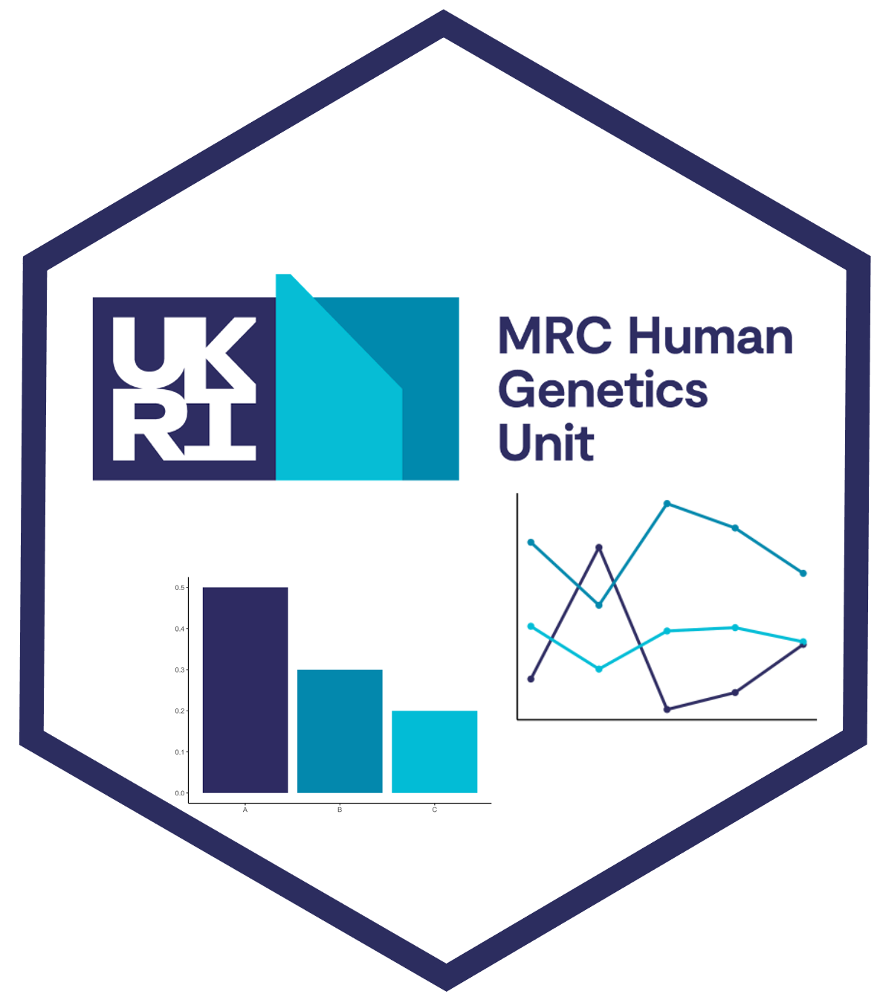

<!-- README.md is generated from README.Rmd. Please edit that file -->

```{r, include = FALSE}
knitr::opts_chunk$set(
  collapse = TRUE,
  comment = "#>",
  fig.path = "man/figures/README-",
  out.width = "100%"
)
if (!require("tidyverse", quietly = TRUE))
    install.packages("tidyverse")
library(HGUTheme)
library(tidyverse)
```

# HGUTheme 

<!-- badges: start -->

[](https://opensource.org/licenses/MIT)
[](https://www.repostatus.org/#active)
[](https://app.codecov.io/gh/hwarden162/HGUTheme?branch=main)
[](https://github.com/hwarden162/HGUTheme/actions/workflows/pages/pages-build-deployment)
<!-- badges: end -->

Repository for the `HGUTheme` package. Information on the package can be found on the [package website](https://hwarden162.github.io/HGUTheme).

Suggestions and collaboration are always welcome. Please do so by contacting us, raising an issue on the GitHub repository or by directly making a pull request.
