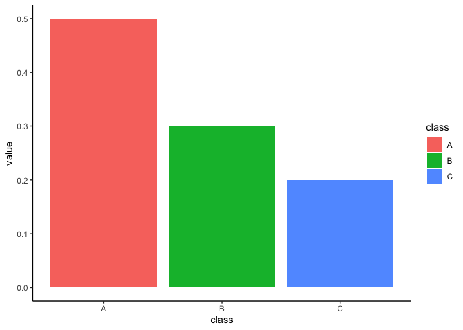
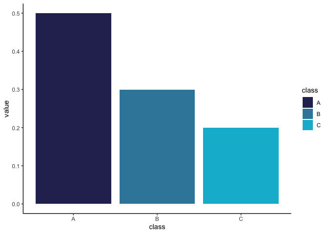

<!-- README.md is generated from README.Rmd. Please edit that file -->

# HGUTheme

<!-- badges: start -->

[](https://opensource.org/licenses/MIT)
[](https://www.repostatus.org/#active)
[](https://app.codecov.io/gh/hwarden162/HGUTheme?branch=main)
[](https://github.com/hwarden162/HGUTheme/actions/workflows/pages/pages-build-deployment)
<!-- badges: end -->

Unofficial ggplot2 themes for using the colour palette of the MRC HGU
logo.

The MRC Human Genetics Unit Powerpoint template comes with a preset
colour theme that controls the colours of most elements of the
presentation. When creating a plot in `ggplot2` it is possible to set
the colour of various parts of various elements and `HGUTheme` contains
multiple functions to help you do so. It is not always appropriate to
use these colours (as discussed in ‘Get started’) but where it is
appropriate `HGUTheme` allows you to easily create a consistent colour
theme for your presentations.

**These palettes were created to align with the colour schemes of the
MRC and HGU palettes. However, the original palettes were not designed
for use on plots and so please consider the effect of your colour
choices for colourblind people when constructing your plots.**

## Installation

You can install the development version of HGUTheme from
[GitHub](https://github.com/hwarden162/HGUTheme) with:

``` r
# install.packages("devtools")
devtools::install_github("hwarden162/HGUTheme")
```

## Quick Use Guide

Each colour has been assigned a function that will return a character
string with the corresponding HEX code. For example:

``` r
hgu_dark()
#> [1] "#2D2E5F"
```

These are then grouped into palettes that are also stored in functions:

``` r
hgu_palette()
#> [1] "#2D2E5F" "#3A88A9" "#00BAD2"
```

For users’ convenience, various functions have been written that set
these colour values

``` r
plot_data <- tibble(
  class = c("A", "B", "C"),
  value = c(0.5,0.3,0.2)
)
plot_data
#> # A tibble: 3 × 2
#>   class value
#>   <chr> <dbl>
#> 1 A       0.5
#> 2 B       0.3
#> 3 C       0.2
```

A basic plot of this data would look like this

``` r
plot_data %>%
  ggplot(aes(x = class, y = value, fill = class)) +
  geom_col() +
  theme_classic()
```



A layer can be added to change the fill of the boxes to match that of
the MRC HGU powerpoint theme

``` r
plot_data %>%
  ggplot(aes(x = class, y = value, fill = class)) +
  geom_col() +
  theme_classic() +
  scale_fill_hgu()
```



## Colour Codes

Taken from the MRC HGU Powerpoint template:

-    Dark
    blue: `#2D2E5F`
-    Mid
    blue: `#3A88A9`
-    Light
    blue: `#00BAD2`

Taken from the MRC Powerpoint template:

-    Dark Blue:
    `#2E2C5E`
-   
    Darkish blue: `#102F83`
-    Mid
    blue: `#305CEF`
-    Red:
    `#D85941`
-    Green:
    `#4AA789`
-   
    Yellow: `#F1BE44`
-    Gray:
    `#DADADA`
